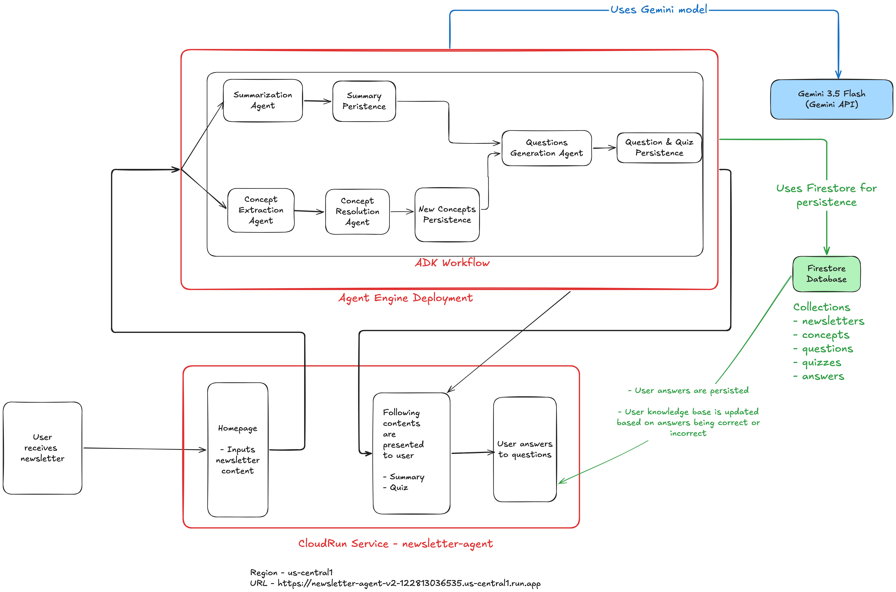

# newsletter-agent-v2

Reading newsletters made easy!

## Live Demo URL

https://newsletter-agent-v2-122813036535.us-central1.run.app

## Demo Video Link

https://youtu.be/PMtQuFvrtbo

## Problem

We all find ourselves with inbox full of unread newsletters. Though we subscribe to interesting topics, we hardly have time to go through a newsletter even if it is genuinely interesting. I felt the need for a system that would to help me read and understand the newsletters better. 

## What does this agent do?

This system takes in newsletter as input and constructs the following
- Summary
- Quiz on concepts taught in the newsletter
- Upon Quiz submission, the system updates knowledge base of user based on his response to questions

The most important part is the **knowledge base that gets built and updated** as user answers more quizzes. 

This knowledge base is **foundation for future iterations** to build personalized summaries and building personalized quizzes based on the user's knowledge.

## Architecture Diagram



## Services

- Cloud Run Service
    - Handles the UI and user flow
    - Shows UI for newsletter input
    - Shows Quiz
- Agent (Vertex Agent Engine)
    - Workflow for newsletter ingestion

## Tech Stack

- Gemini 3.6 Flash
- Google Agent Development Kit (ADK)
    - Workflow
- CloudRun Service
- Firestore Database

## Pre-requisites

- Node version = `v24.13.0`
- npm version = `11.8.0`
- Your GCP Project
- `gcloud` CLI installed

## Environment Variables

```
GOOGLE_CLOUD_PROJECT=newsletter-agent-v2
GOOGLE_CLOUD_LOCATION=global
FIRESTORE_PROJECT_ID=newsletter-agent-v2
FIRESTORE_DATABASE_ID=newsletter-agent-v2-db
GEMINI_MODEL="gemini-3.6-flash"
GOOGLE_GENAI_USE_VERTEXAI=true
AGENT_URL=YOUR_AGENT_ENGINE_DEPLOYMENT_URL
```

Change the values as per your project's values

## Local Setup

- Clone repo
- Do `npm i`
- Create `.env` file at root with values as described in previous section
- In Terminal 1, Start the NodeJS service - `npm run dev`
- In Terminal 2, Start the ADK Agent API Server - `npx adk api_server`

## Deployments

### Pre-requisites

### Step 1
Set your project as default project in glcoud CLI

```
gcloud config set project YOUR_PROJECT_ID
```

### Step 2

Enable required services in GCP project

```
gcloud services enable run.googleapis.com firestore.googleapis.com \
    aiplatform.googleapis.com \
    cloudbuild.googleapis.com artifactregistry.googleapis.com
```

### Step 3

Update the `default` Service Account for your GCP Project with access to the following
- Cloud Build Service Account
- Cloud Datastore User
- Vertex AI User

### Agent Deployment to Vertex Agent Engine

#### Step 1 - Compile agent.ts file

```bash
npx esbuild agent.ts --bundle --packages=external --platform=node \
    --format=esm --outfile=deploy/agent.mjs
```

#### Step 2 - Deploy to Agent Engine using adk command

```bash
npx adk deploy agent_engine deploy/agent.mjs \
	--compile false --bundle false \
	--region us-central1 \
	--repository newsletter-agent-v2 \
	--display_name newsletter-agent-v2
```

### UI Service - Deployment to Cloud Run

```bash
gcloud run deploy newsletter-agent-v2 \
    --source . \
    --project newsletter-agent-v2 \
    --region us-central1 \
    --allow-unauthenticated \
    --timeout=600 \
    --max-instances=1 \
    --concurrency=1 \
    --set-env-vars GOOGLE_GENAI_USE_VERTEXAI=true,GOOGLE_CLOUD_PROJECT=newsletter-agent-v2,GOOGLE_CLOUD_LOCATION=global,FIRESTORE_DATABASE_ID=newsletter-agent-v2-db,GEMINI_MODEL=gemini-3.6-flash
```

## Datasources

- Newsletter content is provided by user, pasted directly into the app
- Only external service called is Gemini API
- All derived data (summary, question, concepts) are generated by agents and persisted in Firestore
- No scraping, no external datasets, no third party content APIs

## Data Model

- This project uses Firestore Database to persist all data
- Collections defined are as follows
    - newsletters
    - concepts
    - questions
    - quizzes
    - attempts
    - users

## Roadmap

- ✅ v0 - CloudRun deployment
	- Simple agent with one or two tools usage
- ✅ v1 - Generic Summarization of NewsLetter
    - Basic gemini integration
    - Define input for agent
    - Define how an agent is invoked
    - Setup e2e flow
- ✅ v2 - MCQ question list creation (backend)
    - Assumptions 
	    - Course creation can be done later
	    - The content of course can any ways be read from the newsletter content itself
    - Knowledge model 
	    - Concepts to be decided here for every mcq question
- ✅ v3 - MCQ question list creation (rendering)
    - Rendering should be as simple as possible
    - Do not complicate this
- ✅ v4 - Feedback Loop
	- User answers are the feedback from user here
	- Update knowledge model - based on answers to mcq
- ✅ v5 - ADK native Workflow implementation
- ✅ v6 - Deployment to Vertex Agent Engine
- 🟠 v7 - Tailored Summarization
    - Make use of knowledge model
    - Summarize based on knowledge model
	    - Explain unknown concepts more than known concepts
- 🟠 v8 - Pre-requisites section to "Summary"
- 🟠 v9 - Course Creation
- 🟠 v10 - Misconception Distractions for wrong options in the MCQ
